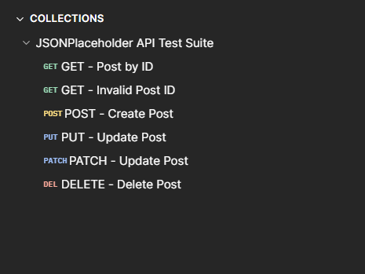
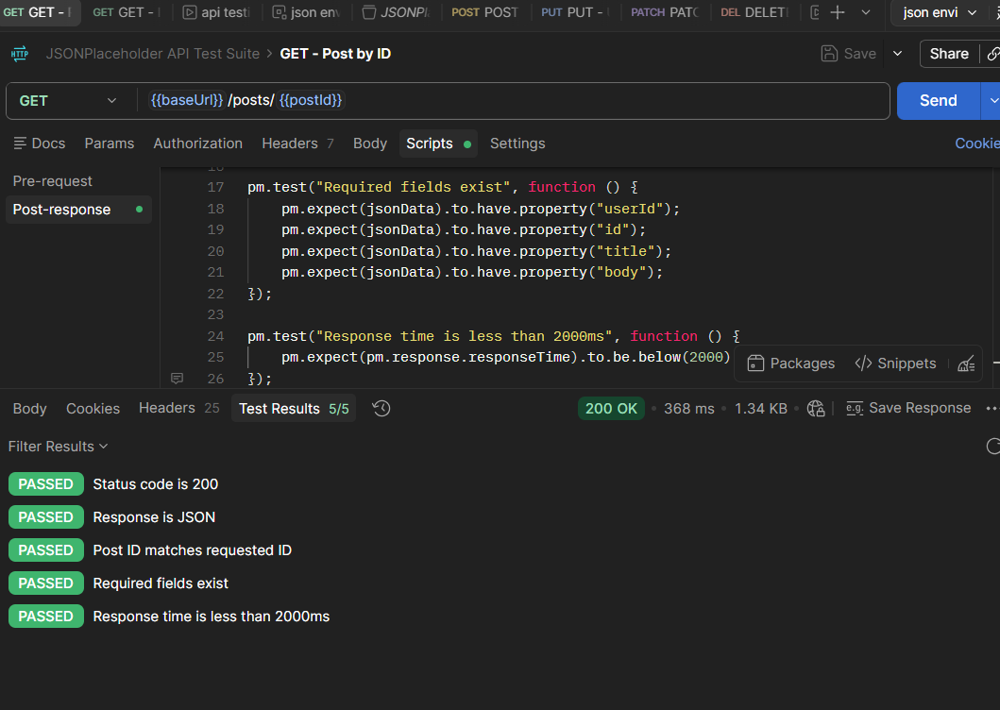
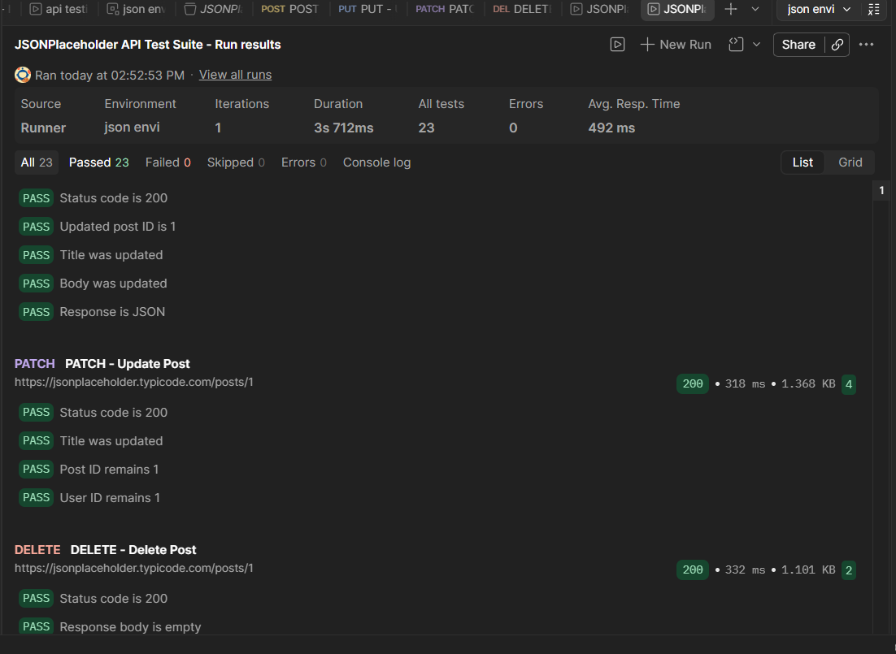

# JSONPlaceholder API Testing using Postman

## About the project

I created this project to practice API testing using Postman and to understand how APIs behave for different types of requests.

I tested the JSONPlaceholder REST API and created a small test suite for CRUD operations.

## Tools used

- Postman
- JavaScript (for Postman test scripts)
- JSONPlaceholder API

## API operations tested

- GET - Get a post
- POST - Create a post
- PUT - Update a post
- PATCH - Partially update a post
- DELETE - Delete a post

## Testing done

I tested:

- Valid requests
- Invalid post ID
- Response status codes
- Response body
- Response headers
- Response time
- Required response fields
- Dynamic values using Postman variables
- Automated assertions using JavaScript
- Collection Runner

## Example test cases

| Test | Expected result |
|---|---|
| GET post with valid ID | 200 OK |
| GET post with invalid ID | 404 Not Found |
| POST with valid data | 201 Created |
| PUT update | 200 OK |
| PATCH update | 200 OK |
| DELETE post | 200 OK |

## Automation

I added Postman test scripts to automatically check things like:

- Status code
- Post ID
- User ID
- Required fields
- Content-Type
- Response time
- Updated values

I also used variables such as `{{baseUrl}}` and `{{postId}}` so that the same request and test could be used with different values.

## Project files

- `Test-Cases/` - manual test cases and Postman checks
- `Postman/` - API requests and automated tests
- `Screenshots/` - Postman collection, automated tests, and collection run results

## Important note

JSONPlaceholder is a fake REST API used for testing and practice. Some operations such as POST, PUT, PATCH and DELETE are simulated and are not permanently stored like they would be in a real application.

## What I learned

Through this project I practiced how to:

- Send API requests in Postman
- Validate API responses
- Write positive and negative test cases
- Use Postman variables
- Write basic JavaScript assertions

## Screenshots

### Postman Collection

### Automated API Tests

### Collection Run Results

- Run multiple API requests as a collection
- Investigate failed API tests instead of assuming the API is wrong
